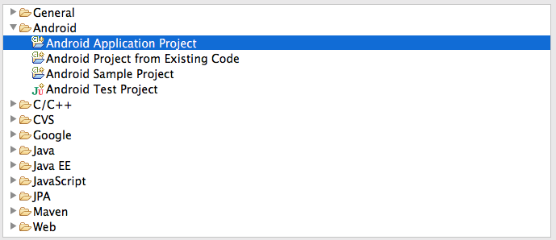
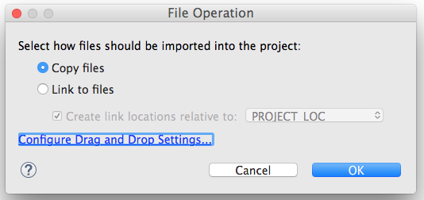
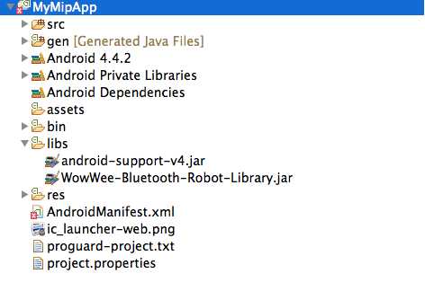
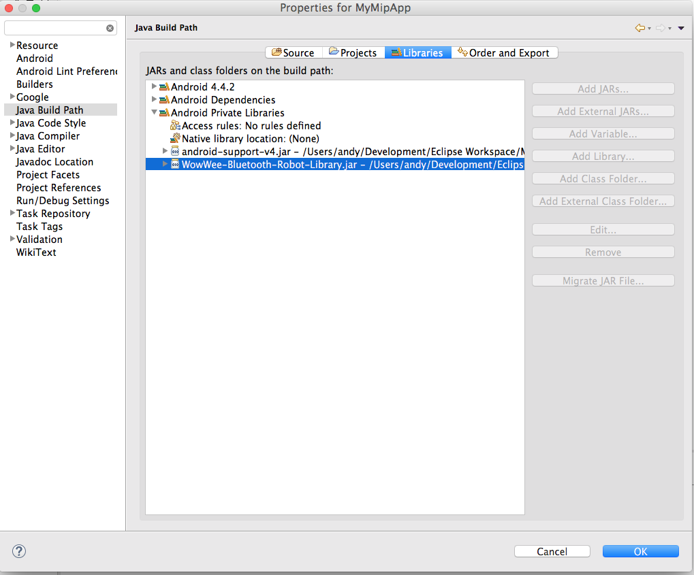

WowWee MiP Android SDK
================================

The free MiP Android SDK lets you control your [WowWee MiP robot](www.meetmip.com) on devices running Android 4.3 and above with Bluetooth Low Energy chipsets. To use this SDK you will also need a physical MiP robot.

A list of devices we expect to be compatible is listed [on our website](http://www.wowwee.com/mip/compatibility).

There is also an [iOS SDK](https://github.com/WowWeeLabs/MiP-iOS-SDK) and [PhoneGap SDK](https://github.com/WowWeeLabs/MiP-PhoneGap-SDK) version available.

For information on WowWee products visit: <http://www.wowwee.com>

Table of Contents
---------------------------------------

- [Quick Installation](#quick-installation)
- [Notes about the SDK](#notes-about-the-sdk)
- [Using the SDK](#using-the-sdk)
	- [Working with Multiple MiPs](#working-with-multiple-mips)
- [License](#license)
- [Contributing](#contributing)
- [Credits](#credits)
- [Projects using this SDK](#projects-using-this-sdk)

Quick Installation
---------------------------------

1. Clone the repository or [download the zip](https://github.com/WowWeeLabs/MiP-Android-SDK/archive/master.zip).

		git clone https://github.com/WowWeeLabs/MiP-Android-SDK.git

Depending on your setup and whether you are using Eclipse or Android Studio, the instructions will be slightly different howeer the library should work well with both. We have provided sample projects to get you started for both systems under the SampleProjects directory.

2. If using Eclipse, Create a new project by going to _File->_New_->_Project_. The simplest application is an Android Application Project.

3. The most important thing to set when creating a new project is to make sure that you set the Android Minimum SDK to version 4.3. Versions of Android below 4.3 do not include the necessary Bluetooth Low Energy APIs so cannot support MiP.

4. Open the project explorer in Eclipse and drag the **WowWee-Bluetooth-Robot-Library.jar** file to the libs directory for your project.

Your project should look like the following in the project explorer

5. Confirm that the jar library is added to your project by going into _Project_->_Properties_, then go to _Java Build Path_ then _Libraries_ then press the down arrow on _Android Private Libraries_. On older versions of the Android SDK tools, the library is not automatically added into here, so you will need to manually add it by pressing _Add Jar_.

    If the library appears like the screenshot then you don't need to do anything. Click _OK_ to close the project properties.

6. In the AndroidManifest.xml, add the following lines under the root manifest tag if they do not already exist:

		<uses-permission android:name="android.permission.BLUETOOTH"/>
		<uses-feature android:name="android.hardware.bluetooth_le" android:required="true"/>
		<uses-feature android:name="android.hardware.bluetooth" android:required="true"/>

Also under the <application> section add the following under the application section:

		<service android:name="com.wowwee.bluetoothrobotcontrollib.BluetoothLeService" android:enabled="true"/>

Your AndroidManifest.xml \<application\> section should look similar to the following:

		<manifest xmlns:android="http://schemas.android.com/apk/res/android"
				package="com.example.mymipapp"
				android:versionCode="1"
				android:versionName="1.0" >

			<uses-sdk
				android:minSdkVersion="18"
				android:targetSdkVersion="19" />

			<uses-permission android:name="android.permission.BLUETOOTH"/>
			<uses-feature android:name="android.hardware.bluetooth_le" android:required="true"/>
			<uses-feature android:name="android.hardware.bluetooth" android:required="true"/>

			<application
					android:allowBackup="true"
					android:icon="@drawable/ic_launcher"
					android:label="@string/app_name"
					android:theme="@style/AppTheme" >

				<service android:name="com.wowwee.bluetoothrobotcontrollib.BluetoothLeService" android:enabled="true"/>

			</application>
		</manifest>

7. Check that the project compiles successfully after completing the above steps by pressing ⌘+B in Eclipse to build the project. The project should build successfully.

8. In your MainActivity onCreate method you must add in some handling code to setup the Bluetooth manager and connect to the first available MiP.

		private BluetoothAdapter mBluetoothAdapter;

		@Override
		protected void onCreate(Bundle arg0) {
			super.onCreate(arg0);
			setContentView(R.layout.activity_main_menu);

			final BluetoothManager bluetoothManager = (BluetoothManager) this.getSystemService(Context.BLUETOOTH_SERVICE);
			mBluetoothAdapter = bluetoothManager.getAdapter();

			// Set BluetoothAdapter to MipRobotFinder
			MipRobotFinder.getInstance().setBluetoothAdapter(mBluetoothAdapter);

			// Set Context to MipRobotFinder
			MipRobotFinder finder = MipRobotFinder.getInstance();
			finder.setApplicationContext(getApplicationContext());
		}

		@Override
		protected void onResume() {
			super.onResume();

			this.registerReceiver(mMipFinderBroadcastReceiver, MipRobotFinder.getMipRobotFinderIntentFilter());
			if (mBluetoothAdapter != null && !mBluetoothAdapter.isEnabled()) {
				if (!mBluetoothAdapter.isEnabled()) {
					TextView noBtText = (TextView)this.findViewById(R.id.no_bt_text);
					noBtText.setVisibility(View.VISIBLE);
				}
			}

			// Search for mip
			MipRobotFinder.getInstance().clearFoundMipList();

			// When doing a search, turn off any existing searches and try again
			scanLeDevice(false);
			scanLeDevice(true);
		}

		private final BroadcastReceiver mMipFinderBroadcastReceiver = new BroadcastReceiver() {
			@Override
			public void onReceive(Context context, Intent intent) {
				final String action = intent.getAction();
				if (MipRobotFinder.MipRobotFinder_MipFound.equals(action)) {
					// Connect to mip
					final Handler handler = new Handler();
					handler.postDelayed(new Runnable() {

						@Override
						public void run() {
							List<MipRobot> mipFoundList = MipRobotFinder.getInstance().getMipsFoundList();
							if (mipFoundList != null && mipFoundList.size() > 0){
								MipRobot selectedMipRobot = mipFoundList.get(0);
								if (selectedMipRobot != null){
									connectToMip(selectedMipRobot);
								}
							}
						}
						}, 3000);

					}
				}
			};

			private void connectToMip(final MipRobot mip) {
				this.runOnUiThread(new Runnable() {

					@Override
					public void run() {
						mip.setCallbackInterface(MainMenuActivity.this);
						mip.connect(MainMenuActivity.this.getApplicationContext());
						TextView connectionView = (TextView)MainMenuActivity.this.findViewById(R.id.connect_text);
						connectionView.setText("Connecting: "+mip.getName());
					}
					});

				}

				//	@Override
				public void mipDeviceReady(MipRobot sender) {
					final MipRobot robot = sender;
					this.runOnUiThread(new Runnable() {
						@Override
						public void run() {
							Log.d(“MipSDK Connected To ”,robot.getName());
						}
						});
					}

8. You should be now ready to go! Plug in an Android device then compile and run the project using ⌘+R . When you turn on a MiP you should see some debug messages in the logs.

Using the SDK
---------------------------------

### Working with Multiple MiPs
In the example above, we automatically connect to the first available MiP. If you wanted to just update a list you would do something like the following:

	private final BroadcastReceiver mMipFinderBroadcastReceiver = new BroadcastReceiver() {
		@Override
		public void onReceive(Context context, Intent intent) {
			final String action = intent.getAction();
			if (MipRobotFinder.MipRobotFinder_MipFound.equals(action)) {
				// Connect to mip
				final Handler handler = new Handler();
				handler.postDelayed(new Runnable() {

					@Override
					public void run() {
						updateMipList();
					}
				}, 3000);
			}
		}
	};

	public void updateMipList()
	{
		List<MipRobot> mipFoundList = MipRobotFinder.getInstance().getMipsFoundList();
		for(MipRobot mipRobot : mipFoundList) {
			Log.d(“MipSDK Found ”,mipRobot.getName());
		}
	}

For more examples on how to use MiP please refer to our included sample project

Notes about the SDK
---------------------------------

### Simulator Support

Our SDK cannot be used in the built in Android simulator due to lack of Bluetooth Low Energy support. Third party alternatives may work if they support the official BLE APIs.

### Android Gear Support

At present we havn't added support for Android gear. Third party support is welcome, please add an issue in the bug tracker.

### Full Source Code

At this stage we do not plan on releasing our full library source code.

### Are there any restrictions on releasing my own application?

The SDK is currently and will always be free for you to build and release your own applications. Your welcome to charge money or release free applications using our SDK without restrictions.

If you create a great application, all we ask is that you provide a link for people to purchase their own MiP so they can enjoy your product.

### Can I use your cool joystick code?

Yes we have provided the source code in our sample project, feel free to use this or make changes as you want. We would love pull requests.

### Can I create other platform versions of the SDK?

The lower level BLE command protocol is available in our [MiP-BLE-Protocol](http://github.com/WowWeeLabs/MiP-BLE-Protocol) repository, please post any other platform questions there.

License
---------------------------------
MiP Android SDK is available under the Apache License, Version 2.0 license. See the [LICENSE.txt](https://raw.githubusercontent.com/WowWeeLabs/MiP-Android-SDK/master/LICENSE.md) file for more info.

You are free to use our SDK in your own projects whether free or paid. There are no restrictions on releasing into Google Play or other stores. We do ask that you clearly differentiate your app from the official app so that users do not get confused.

Contributing
---------------------------------
We happily accept any pull requests and monitor issues on GitHub regularly. Please feel free to give us your suggestions or enhancements. Please note that due to resource constraints we most likely cannot add new features to the MiP robot himself, but we will certainly consider them for inclusion to future robots/versions.

Tell your friends, fork our project, buy our robot and share with us your own projects! These are the best kinds of positive feedback to us.

Projects using this SDK
---------------------------------
* [WowWee MiP Official App](https://play.google.com/store/apps/details?id=com.wowwee.mip&hl=en)
* Send us a pull request to add your app here
